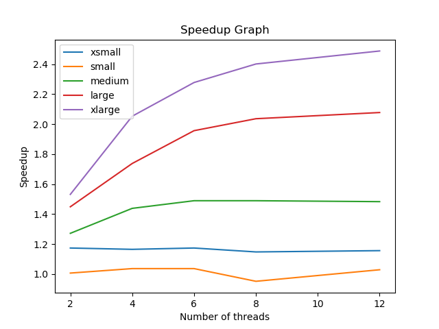

# Performance Analysis

## Problem Description
This project involves implementing a simplified Twitter client-server system to practice low-level parallel programming concepts and data structure design.

In `feed.go`, I developed the core data structure for managing a user's Twitter feed, represented as a singly linked list. The implementation includes methods to add, remove, and check for the presence of posts in the feed, ensuring functional correctness in a sequential context. Later, I enhanced the feed's thread-safety using a custom read-write lock mechanism, implemented as a coarse-grained locking strategy. The read-write lock supports concurrent read operations while enforcing mutual exclusion for write operations, accommodating up to 32 simultaneous readers. This locking mechanism was constructed from scratch using a mutex and a single condition variable.

In `server.go`, I implemented a client-server model where the server processes requests to modify a user's feed based on tasks provided by a client application. Two modes of operation were supported: a sequential mode, where a single goroutine processes all tasks, and a parallel mode leveraging the producer-consumer model with a custom task queue. The task queue was designed as an unbounded, lock-free structure to ensure efficient parallel processing without blocking operations. The parallel version spawns multiple worker goroutines, each dequeuing and processing tasks concurrently. The server-client interaction uses JSON-encoded requests and responses, employing Go's JSON built-in encoder and decoder for streaming data.

Finally, in `twitter.go`, I created the main program that configures the server and client based on runtime arguments, supporting performance benchmarking and scalability testing.

---

## Results and Discussion

### Speedup Graph and Discussion
The speedup graph shows the performance improvement of the parallel implementation compared to the sequential version across different workload sizes (`xsmall`, `small`, `medium`, `large`, `xlarge`) as the number of threads increases.

#### Results of the Graph
- For smaller workloads (`xsmall` and `small`), speedup is minimal because the overhead of thread management and synchronization outweighs the benefits of parallelism.
- For larger workloads (`large` and `xlarge`), speedup increases significantly, with the highest gains observed at higher thread counts due to effective task distribution across threads.
- Speedup plateaus as the number of threads exceeds the hardware's physical core limit, leading to contention and diminishing returns.

#### Linked-list vs Lock-Free Implementation
- **Sequential Implementation**: Operations like adding, removing, and checking posts must traverse the list or update nodes sequentially, causing significant contention under heavy workloads.
- **Parallel Implementation**: The lock-free queue and multiple threads demonstrate noticeable performance improvements, particularly for larger workloads. Speedup reaches values greater than 2x in some cases but levels off for smaller workloads due to synchronization overhead.

---

### Areas for Hypothetical Performance Improvements
1. **Reader-Writer Lock**:
   - Adopt advanced algorithms like fair or priority-based locks to reduce writer starvation or unnecessary blocking.
   - Use a reader-biased lock for read-heavy workloads.

2. **Lock-Free Queue**:
   - Consider chunk-based queues or flat combining to reduce contention overhead.
   - A bounded queue with dynamic resizing could optimize memory usage.

3. **Producer/Consumer Signaling**:
   - Replace condition variables with adaptive spinning to reduce latency.

---

### Effects of Hardware on Performance
1. **CPU Cores**:
   - Performance improves as more threads are utilized but plateaus beyond the physical core count.

2. **Cache Optimization**:
   - Optimize memory access patterns to reduce cache misses and improve cache coherence.

3. **Memory Bandwidth**:
   - Prefetching and better memory alignment could mitigate bottlenecks under heavy workloads.

---

In conclusion, the project successfully demonstrated the implementation of a simplified Twitter system with both sequential and parallel modes. The parallel version showcased significant performance improvements for larger workloads, while scalability and efficiency were limited by hardware constraints and synchronization overhead.
